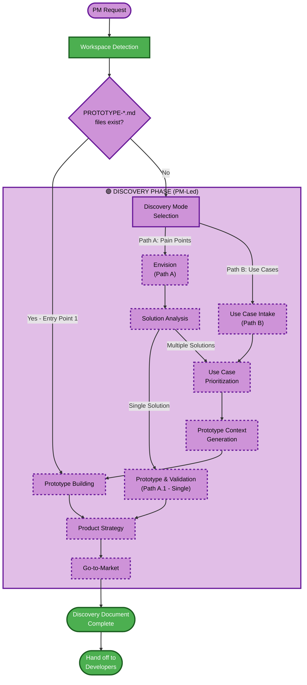

# AI-PLC Discovery Phase Overview

**Purpose**: Technical reference for AI model and Product Managers to understand the Discovery workflow structure.

**Note**: This workspace is exclusively for the Discovery phase. Inception, Construction, and Operations phases happen in a separate developer workspace.

## Discovery Phase Only:
• **DISCOVERY PHASE**: PM-led product definition with 3 entry points
  - Entry Point 1: Existing PROTOTYPE-*.md files → Jump to Prototype Building
  - Entry Point 2: Pain points → PR/FAQ → Solution Analysis → Prototyping
  - Entry Point 3: Use cases → Prioritization → Prototype Context Generation → Prototyping
• **Output**: Discovery Document for developer handoff

## The Discovery Workflow:
• **Workspace Detection** (always) → **Check for PROTOTYPE-*.md** (priority) → **DISCOVERY PHASE** (3 entry points) → **Product Strategy** → **Go-to-Market** → **Discovery Document Complete**

## Discovery Phase Entry Points:
• **Entry Point 1 (Highest Priority)**: PROTOTYPE-*.md files exist → Skip all discovery → Build prototypes directly
• **Entry Point 2 (Path A)**: No PROTOTYPE-*.md → User chooses pain points → Envision → Solution Analysis → Single or Multiple solutions
• **Entry Point 3 (Path B)**: No PROTOTYPE-*.md → User chooses use cases → Use Case Intake → Prioritization → Prototype Context Generation

## How It Works:
• **AI analyzes** your workspace to determine which entry point to use
• **Discovery Phase stages**: Workspace Detection (always), then one of three paths based on situation
• **Output**: Discovery Document containing pain points/use cases, PROTOTYPE-*.md files, Product Strategy, and Go-to-Market plan
• **Handoff**: Developers use Discovery Document in their workspace for Inception, Construction, and Operations phases

## Your Role as Product Manager:
• **Answer questions** in dedicated question files using [Answer]: tags with letter choices (A, B, C, D, E)
• **Option E available**: Choose "Other" and describe your custom response if provided options don't match
• **Review and approve** each Discovery stage before proceeding
• **Make product decisions** on strategy, positioning, and go-to-market
• **Important**: Focus on product vision - technical implementation happens in developer workspace

## AI-PLC Discovery Phase Workflow:

## Stage Descriptions:

### 🟣 DISCOVERY PHASE - PM-Led Product Definition

**Three Entry Points:**

#### Entry Point 1: Existing PROTOTYPE-*.md Files (Highest Priority)
- Workspace Detection finds PROTOTYPE-*.md files in workspace
- Skip all discovery phases (pain points, PR/FAQ, use case intake, prioritization)
- Jump directly to Prototype Building
- Typical scenario: Workshop environment where teams receive pre-generated specifications

#### Entry Point 2: Path A - Start from Pain Points
- Discovery Mode Selection: User chooses [A] Pain points
- Envision: Gather customer pain points, generate PR/FAQ using Working Backwards
- Solution Analysis: Determine single solution or multiple solutions
  - Single solution → Prototype & Validation (existing flow)
  - Multiple solutions → Use Case Prioritization → Prototype Context Generation
- Product Strategy: Positioning, differentiation, business model
- Go-to-Market: Marketing strategy, sales approach, launch planning

#### Entry Point 3: Path B - Start from Use Cases
- Discovery Mode Selection: User chooses [B] Use cases
- Use Case Intake: Gather N use cases (could be 3, 5, 10, 20+)
- Use Case Prioritization: Apply frameworks (separate for agentic vs application), select top 3
- Prototype Context Generation: Generate PROTOTYPE-{use-case}.md files for top 3
- Decision: Build prototypes now or hand off files to teams
- Prototype Building: Build from PROTOTYPE-*.md specifications (if user chooses to build)
- Selection: Pick winning use case from prototypes
- Product Strategy: For selected use case
- Go-to-Market: For selected use case

### Key Features:
- **PM-Focused**: Exclusively for Product Managers
- **Workshop-Friendly**: Teams can work in parallel with PROTOTYPE-*.md files
- **Scalable**: Supports any number of use cases (N)
- **Flexible**: Can stop after generating PROTOTYPE-*.md files for handoff
- **Transparent**: Always shows defaults, asks for LLM provider
- **Standard AIPLC**: Uses [Answer]: format throughout
- **Complete Output**: Discovery Document ready for developers

### What Happens After Discovery:
Developers receive the Discovery Document in a **separate workspace** and use it for:
- **Inception Phase**: Requirements Analysis, Workflow Planning, Application Design
- **Construction Phase**: Code Generation, Build & Test
- **Operations Phase**: Deployment, Monitoring

## Key Principles:
- **Discovery Only**: This workspace focuses exclusively on product definition
- **Three Entry Points**: Flexible starting points based on situation
- **PM-Led**: Product Managers drive the process
- **Developer Handoff**: Complete Discovery Document for seamless transition
- **Adaptive**: Workflow adjusts based on your needs and situation
